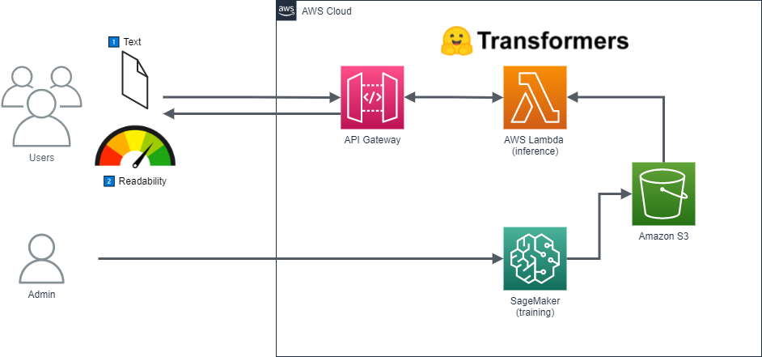

# readability-prediction

Post: https://javiercampos.es/blog/2022/01/08/como-predecir-la-legibilidad-de-un-texto-usando-nlp-hugging-face-y-amazon-sagemaker-serverless-inference/

Versión inicial de la arquitectura (descartada):

Versión actual de la arquitectura (usando **SageMaker Serverless Inference**):

